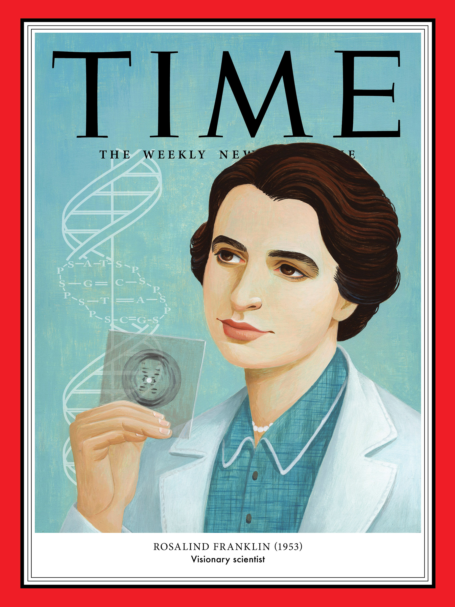

# Rosalind Franklin
** Práctica 01 **

- Nació en Londres, el 25 de julio de 1920.
- Murió en Londres, el 16 de abril de 1958.
Rosalind Franklin nació en el seno de una familia judía de buena posición económica. Desde edad muy temprana, mostró una excelente aptitud y actitud para estudiar, destacando en diversas materias, entre ellas, las ciencias.
Graduada en Química-Física (1941) por el Newnham College (Cambridge) y Doctora en Química (1945) por la Universidad de Cambridge.
## Aportaciones 
1. La cristalografía analizaba la forma en que los cristales se difractan, o se dispersan formando patrones, sobre platos fotográficos. Estos patrones pueden usarse para entrever las estructuras moleculares tridimensionales del objeto de estudio.
2. Capturo la famosa foto 51, que revelaba la estructura de doble helice de la mólecula de ADN.
3. Ella hizo importantes contribuciones al descubrimiento de la forma del ADN.
- Detalló, las distancias relativas de los distintos elementos repetitivos en una molécula de ADN.
- Anotó detalles que sugerían que la molécula de ADN constaba de dos partes iguales y complementarias
4. Hizo aportes en el estudio de virus, en concreto, del mosaico del tabaco y el de la polio que todavía citan los expertos.
### Referencias
- BBC News Mundo. (2018, 26 mayo). Rosalind Franklin, la olvidada científica detrás del descubrimiento de la estructura del ADN, uno de los más importantes para la medicina moderna. Recuperado 5 de noviembre de 2021, de https://www.bbc.com/mundo/noticias-44225714
- Stadler, M. M. (2014, 9 mayo). El caso de Rosalind Franklin. Mujeres con ciencia. Recuperado 5 de noviembre de 2021, de https://mujeresconciencia.com/2014/05/09/el-caso-de-rosalind-franklin/
#### Datos
_Frida Fernanda López Pérez_
_Semestre 2022-1_
_05/11/2021_
